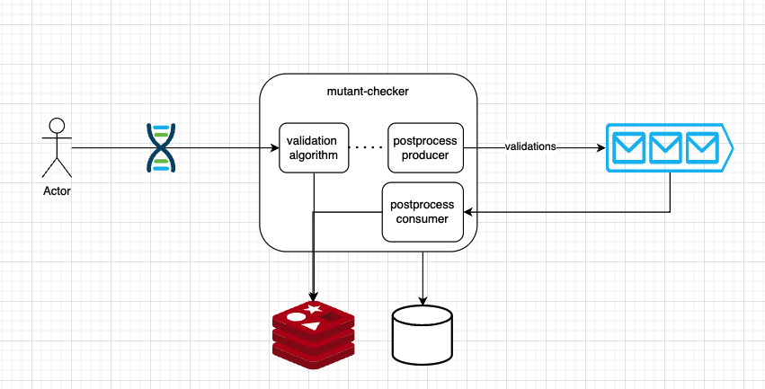

# Examen-mercadolibre-mutante
Prueba Técnica Backend 'MercadoLibre' - Proyecto Identificador de Mutantes. API REST para identificar si un humano es mutante dado su ADN  almacenando y disponibilizando las estadísticas de validaciones a través del método implementado (humanos, mutantes y ratio).
## Required Setup
* Java 11

## Use

##Full environment:
run this command to execute
```
docker-compose up -d
```
## API LOCAL
to explore the API open:
http://localhost:8080/api/mutant-check/swagger-ui/index.html

## API CLOUD
The API and postgres DB was deployed in heroku: https://mutantchecker.herokuapp.com/api/mutant-check/swagger-ui/index.html

Redis was deployed in https://app.redislabs.com/

RabbitMQ was deployed in https://api.cloudamqp.com/ 

## Architecture

* Redis to cache the request of /stats and mutant/ and response as fast as posible the request.
* RabitMQ to save asynchronously the outcome of DNA validation and support huge loads.
* Postgres database to save the mutant validations result and statistics.



## Unit test
See the results on https://github.com/quitian14/mutant-checker/runs/6644655653?check_suite_focus=true

## Examen Mercadolibre
Magneto quiere reclutar la mayor cantidad de mutantes para poder luchar
contra los X-Men.

Te ha contratado a ti para que desarrolles un proyecto que detecte si un
humano es mutante basándose en su secuencia de ADN.

Para eso te ha pedido crear un programa con un método o función con la siguiente firma (En
alguno de los siguiente lenguajes: Java / Golang / C-C++ / Javascript (node) / Python / Ruby):
* boolean isMutant(String[] dna); // Ejemplo Java

En donde recibirás como parámetro un array de Strings que representan cada fila de una tabla
de (NxN) con la secuencia del ADN. Las letras de los Strings solo pueden ser: (A,T,C,G), las
cuales representa cada base nitrogenada del ADN.

### No-Mutante
A T G C G A

C A G T G C

T T A T T T

A G A C G G

G C G T C A

T C A C T G


### Mutante
A T G C G A

C A G T G C

T T A T G T

A G A A G G

C C C C T A

T C A C T G


Sabrás si un humano es mutante, si encuentras más de una secuencia de cuatro letras
iguales​, de forma oblicua, horizontal o vertical.
Ejemplo (Caso mutante):

String[] dna = {"ATGCGA","CAGTGC","TTATGT","AGAAGG","CCCCTA","TCACTG"};


En este caso el llamado a la función isMutant(dna) devuelve “true”.
Desarrolla el algoritmo de la manera más eficiente posible.
Desafíos:


## Nivel 1:
Programa (en cualquier lenguaje de programación) que cumpla con el método pedido por
Magneto.

## Nivel 2:
Crear una API REST, hostear esa API en un cloud computing libre (Google App Engine,
Amazon AWS, etc), crear el servicio “/mutant/” en donde se pueda detectar si un humano es
mutante enviando la secuencia de ADN mediante un HTTP POST con un Json el cual tenga el
siguiente formato:

POST → /mutant/
{
“dna”:["ATGCGA","CAGTGC","TTATGT","AGAAGG","CCCCTA","TCACTG"]
}

En caso de verificar un mutante, debería devolver un HTTP 200-OK, en caso contrario un
403-Forbidden

## Nivel 3:
Anexar una base de datos, la cual guarde los ADN’s verificados con la API.
Solo 1 registro por ADN.

Exponer un servicio extra “/stats” que devuelva un Json con las estadísticas de las
verificaciones de ADN: {"count_mutant_dna" : 40, "count_human_dna" : 100, "ratio" : 0.4 }
Tener en cuenta que la API puede recibir fluctuaciones agresivas de tráfico (Entre 100 y 1
millón de peticiones por segundo).
Test-Automáticos, Code coverage > 80%.

